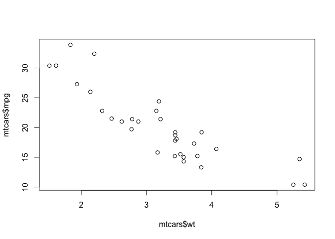

<!-- README.md is generated from README.Rmd. Please edit that file -->
ddsecblog is a knitr output format for creating posts for [Data Driven Security](http://dds.ec/blog)

After doing a `devtools::install_github("hrbrmstr/ddsecblog")` install, format posts like this in an Rmd file to generate an Rmd and figures you can move to the ddsec blog directory structure:

    ---
    Title: RBerkeley Was Just Pining For the Fjords
    Date: 2015-07-27
    Tags: blog, r, rstats
    Category: blog, r, rstats
    Author: Bob Rudis (@hrbrmstr)
    output: ddsecblog::post
    ---


    This is some text.


    ```r
    print("this is some R code")
    #> [1] "this is some R code"
    ```

    This is *MOAR* text


    ```r
    plot(mtcars$wt, mtcars$mpg)
    ```

     

    That was a _plot_.
